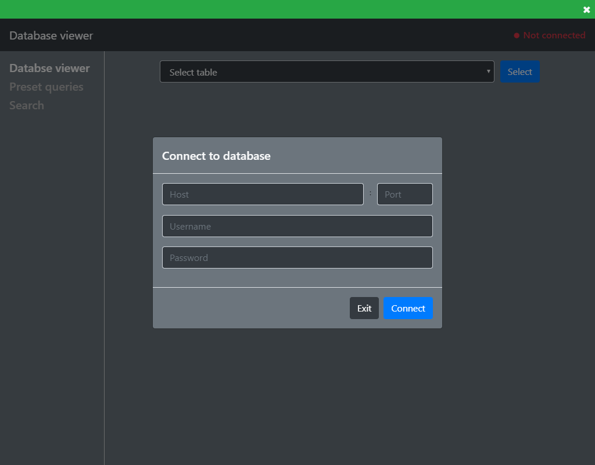
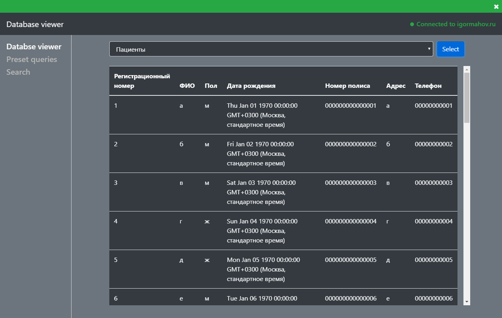
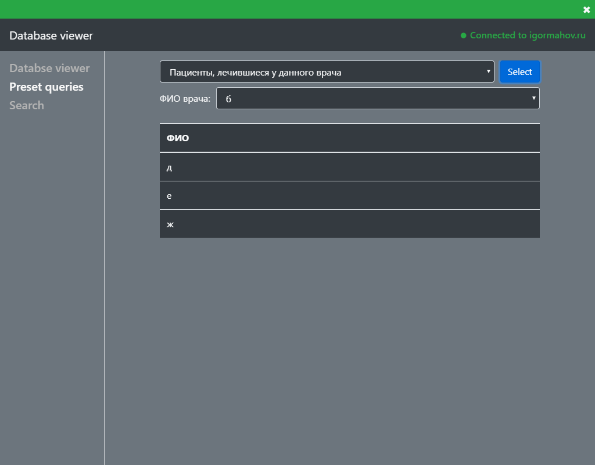
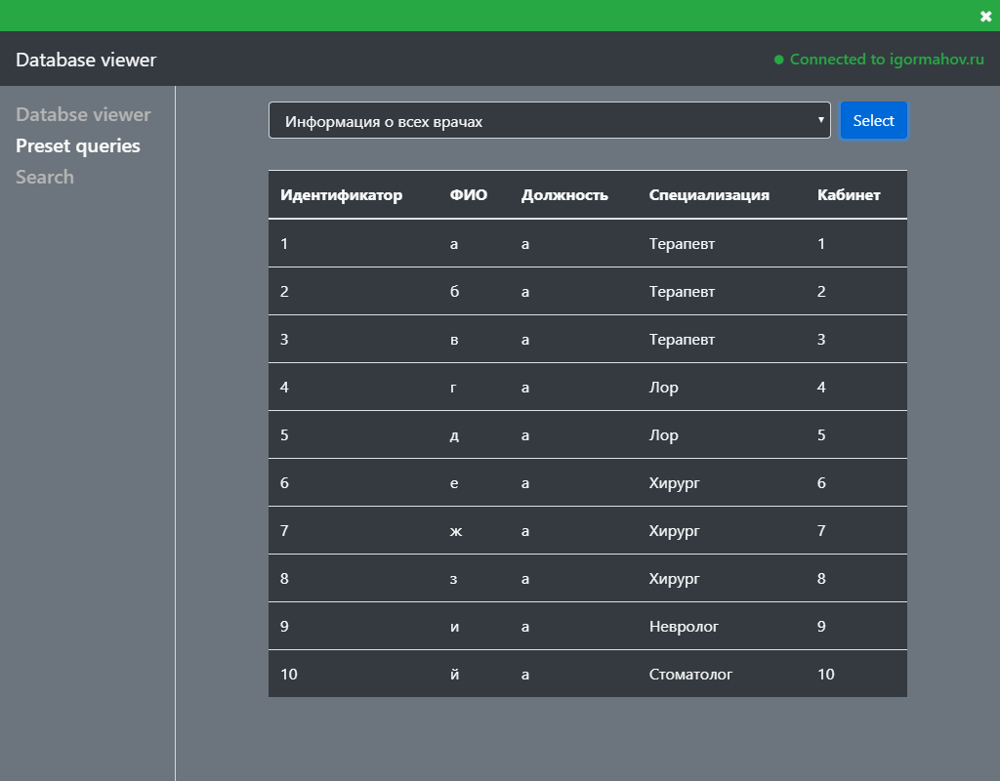
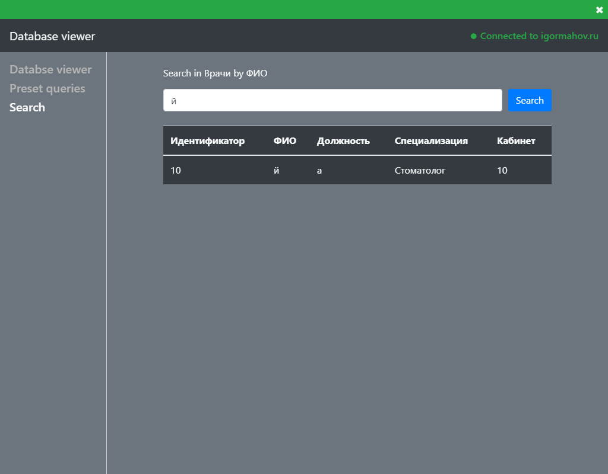

# Database viewer
Simple Postgres database viewer written in [Electron](https://www.electronjs.org) and [Bootstrap](https://getbootstrap.com).
## Demos
### Login page

### Database iewer

### Preset queries
These queries are stored in `app/res/settings.json`
#### With filters

#### Without filters

### Search in database
Search in specified table by specified field.
Options are stored in `app/res/settings.json`

## Todo
- [ ] Fix scrolling in tables
- [ ] Refactor code to make it more readable
- [ ] Rewrite using component framework(React/Vue/Angular)
## Warning
This is just an educational project so it probably won't be developing.
If you are interested in being maintainer please contact me at [tetya.a@yandex.ru](mailto:tetya.a@yandex.ru)
